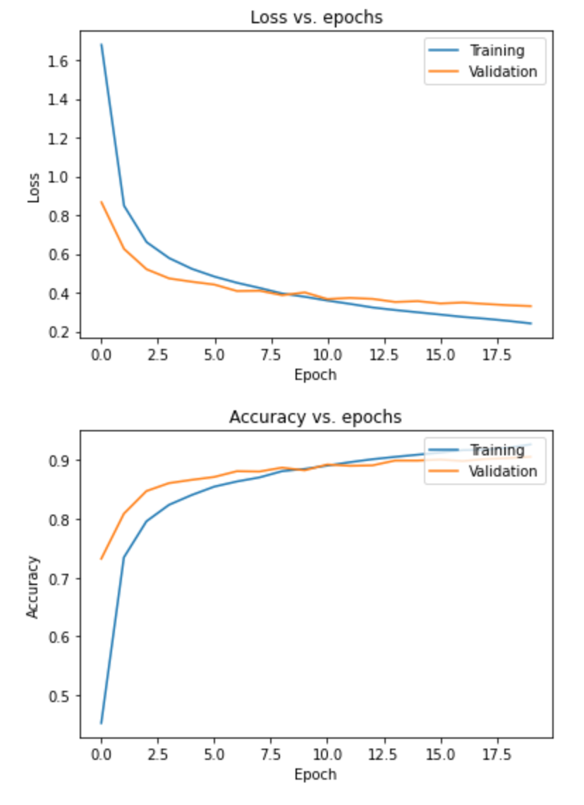
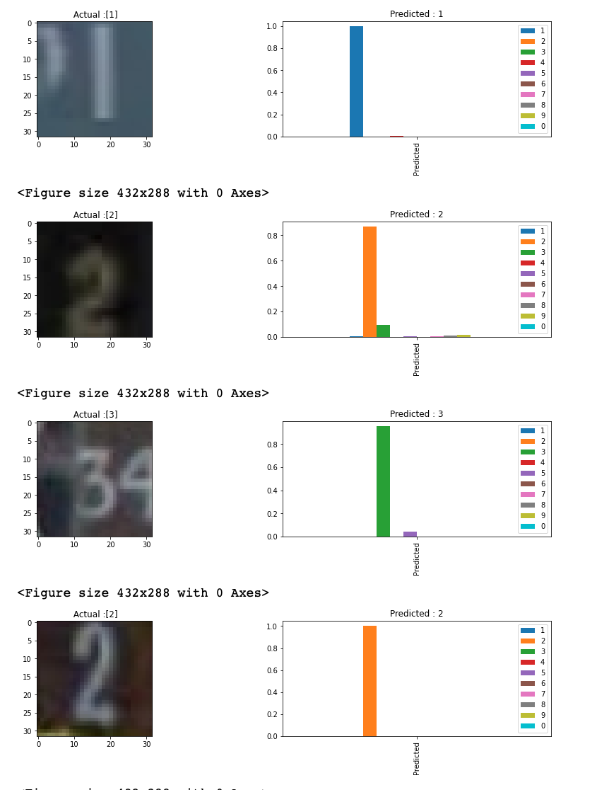

# svhn_capstone
<b>SVHN Image classifier</b>

SVHN is an image dataset of over 600,000 digit images in all, and is a harder dataset than MNIST as the numbers appear in the context of natural scene images.
Model created using tensorflow performed very well with just 20 epochs.

With all the test images predicted correctly.

There is still some scope to improve, using some image filters to filter noise, sharpen images or increase the contrast and so on. Next version to include additional features.

<b>Let us look at the plots of loss and accuracy vs epochs.  Our model predicted all the test images correctly</b>

<b>Below are the examples of predictions of test data.  Our model predicted all the test images correctly</b>

